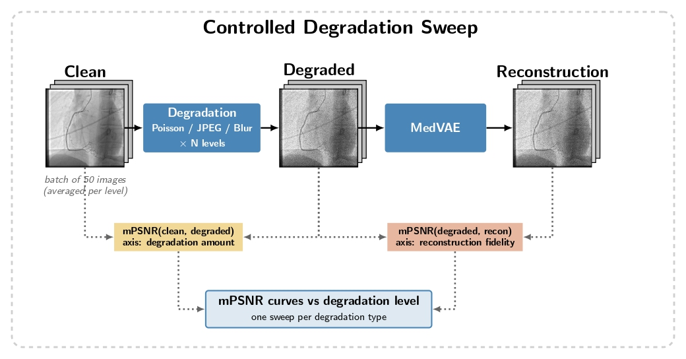
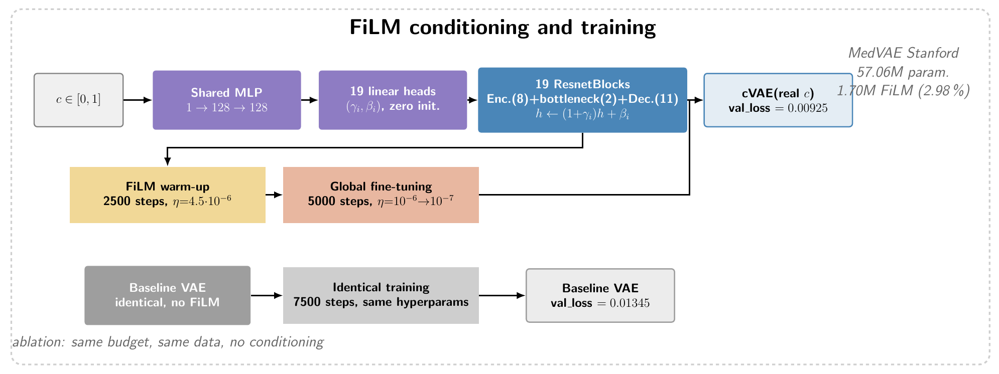
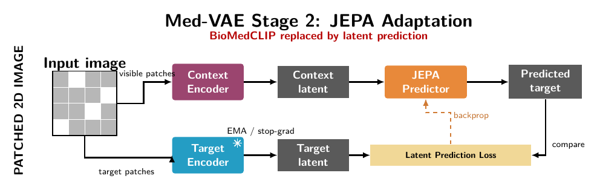
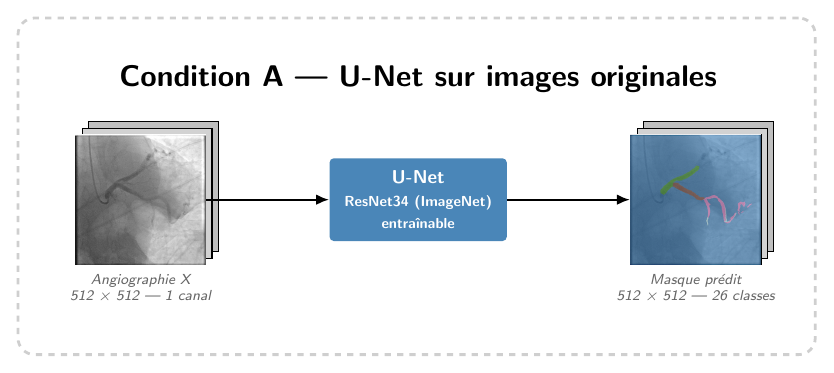
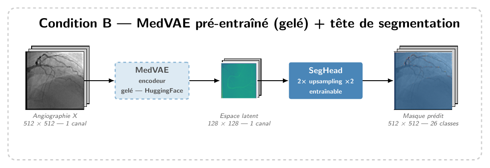
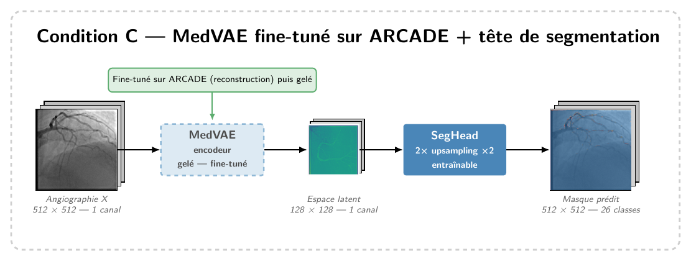
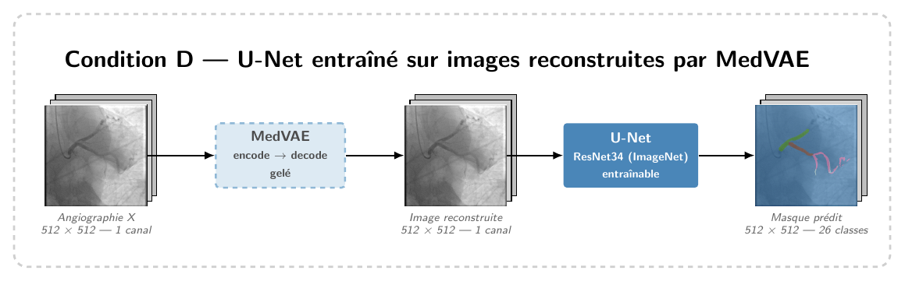

# MedVAE — Adaptation, Fine-tuning and Analysis for Medical Imaging and Coronary Segmentation

> A four-axis study of **MedVAE**, a generic medical autoencoder, applied to the demanding domain of
> **coronary angiography** (ARCADE dataset). We probe its robustness, its conditioning, its latent
> structure and its usefulness for downstream segmentation.

📄 **[Read the paper](final_report/final.pdf)** &nbsp;·&nbsp; 🖥️ **[See the slides](final_report/presentation.pdf)**

**Authors:** Yanic Rothlingshofer · Théo Palagi · Elias Corlou · Théophile Nadiedjoa
*Télécom Paris — IM06 project*

---

## Overview

MedVAE is a medical image autoencoder pre-trained on chest X-rays and mammographies that compresses
images into a compact latent space. Coronary angiographies are structurally very different from those
modalities: thin tubular vessels, bifurcations and stenosis regions that demand fine-grained spatial
encoding to survive compression.

We investigate **one central question along four complementary axes**: *how far can a generic medical
compressor be trusted, adapted and reused on an out-of-distribution modality?*

| Axis | Question | Lead | Code |
|------|----------|------|------|
| **A. Robustness** | How does reconstruction fidelity behave under degraded inputs? | Elias Corlou | [`medvae_eval/`](medvae_eval/) |
| **B. FiLM conditioning** | Can MedVAE be made *acquisition-aware* via a quality score? | Théophile Nadiedjoa | [`medvae_eval/cvae/`](medvae_eval/cvae/) |
| **C. JEPA adaptation** | Can self-supervision replace BioMedCLIP in stage 2? | Yanic Rothlingshofer | [`jepa_adaptation/`](jepa_adaptation/) |
| **D. Segmentation** | Is the latent usable for coronary vessel segmentation? | Théo Palagi | [`finetune/`](finetune/) |

### Key takeaway

MedVAE produces a **faithful, pixel-space–reusable** code, but its latent is **not yet semantically
organized nor acquisition-aware** enough to be segmented or conditioned directly.

---

## A — Robustness of MedVAE to Input Degradations



We measure how reconstruction fidelity degrades when the input is corrupted, motivated by low-dose
acquisition noise, compression and motion artefacts. Using a fully **full-reference** protocol with a
**vessel-masked PSNR (mPSNR)** restricted to ARCADE's coronary annotations, we sweep ~50 levels over
three degradation types and correlate reconstruction quality against degradation amplitude.

- **Gaussian blur** → strong anti-correlation (r ≈ −0.998): blurred inputs reconstruct *better*
  (spectral bias toward low frequencies).
- **Poisson noise** → strong positive correlation (r ≈ +0.998): the latent bottleneck discards
  stochastic high-frequency noise — a genuine but partial denoiser.
- **JPEG compression** → non-monotone: a "blur-like" regime that helps, then a low-quality regime where
  structured block artefacts collapse the reconstruction.

**Conclusion:** MedVAE acts as an intelligent low-pass filter and non-linear denoiser, but collapses on
*structured* out-of-distribution high frequencies — the **nature** of the degradation matters more than
its intensity.

```bash
# Scripts are configured via constants at the top of each file (degradation type, #levels, paths)
cd medvae_eval/scripts
python run_maskedPSNR_sweep.py     # sweep mPSNR over a degradation type
python correlation_analysis.py     # correlate mPSNR(deg, recon) vs mPSNR(clean, deg)
python visualize_degraded.py       # qualitative degradation panels
```

---

## B — Image-Quality Inductive Bias (FiLM conditioning)



We make MedVAE *acquisition-aware* by injecting a scalar quality score `c ∈ [0, 1]` through **FiLM**
modulation (a shared MLP feeding per-block `(γ, β)` heads, zero-initialised), and compare against an
identically-trained baseline VAE with the same budget but no conditioning.

**Conclusion:** the network genuinely exploits the conditioning signal, but FiLM conditioning *slightly
degrades* the reconstruction — an architectural trade-off rather than a free gain.

```bash
# Exploratory notebooks (run top to bottom)
medvae_eval/cvae/03_Inductive_Bias_Generation.ipynb
medvae_eval/cvae/04_MedVAE_Architecture_Mod.ipynb     # FiLM-conditioned MedVAE
medvae_eval/cvae/06_Ablation_c_Constant.ipynb         # ablation vs baseline
```

---

## C — JEPA Adaptation of MedVAE Stage 2



MedVAE's stage 2 relies on **BioMedCLIP** to preserve clinically relevant information in the latent
space. We replace that external vision-language supervision with a self-supervised **JEPA** objective
(inspired by I-JEPA): a context encoder processes visible patches, a frozen EMA target encoder provides
target latents, and a predictor is trained with a latent-prediction loss. Pretraining uses **MedMNIST**
(8 2-D datasets, ~450k images), and the adapted encoder is evaluated by linear probing.

**Conclusion:** the JEPA-adapted latent is markedly more compact (90% of variance on 25 dimensions) and
discriminative, but at a reconstruction cost (frozen decoder) — a more semantic, less pixel-faithful code.

```bash
# Stage 1 — VAE reconstruction pretraining
python jepa_adaptation/stage1_training.py \
  --config jepa_adaptation/configs/stage_1.yaml \
  --model-config jepa_adaptation/configs/model.yaml

# Stage 2 — JEPA latent-prediction adaptation
python jepa_adaptation/stage2_training.py \
  --config jepa_adaptation/configs/stage_2.yaml \
  --model-config jepa_adaptation/configs/model.yaml

# Downstream linear probing
jepa_adaptation/downstream/downstream_1.ipynb
jepa_adaptation/downstream/downstream_2.ipynb
```

SLURM job scripts for the cluster live in [`jepa_adaptation/jobs/`](jepa_adaptation/jobs/).

---

## D — MedVAE as a Latent Representation for Coronary Segmentation

We test whether MedVAE's latent can drive **26-class coronary vessel segmentation** on ARCADE, across
four comparable conditions:

| Condition | Pipeline | Question |
|-----------|----------|----------|
| **A** | U-Net ResNet34 on original 512×512 images | High-resolution reference |
| **B** | Frozen pre-trained MedVAE + lightweight head | Does generic compression suffice? |
| **C** | Frozen ARCADE-finetuned MedVAE + lightweight head | Does fine-tuning the compressor help? |
| **D** | Frozen MedVAE (encode→decode) + trainable U-Net | Does adapting to artefacts compensate? |

| | |
|:---:|:---:|
|  |  |
|  |  |

All conditions are evaluated by mean Dice across the 26 arterial classes on a held-out test set.

**Conclusion:** ×16 compression preserves the anatomy **in pixel space** (targeted gain on thin
vessels), but the single-channel latent remains unsuited to direct dense prediction.

```bash
# Always run from the repo root, as a module (imports are absolute)

# (optional, condition C only) fine-tune MedVAE on ARCADE first
python finetune/finetune_medvae.py --config finetune/configs/medvae_finetune.yaml

# train a condition (a | b | c | d)
python -m finetune.train --config finetune/configs/condition_a.yaml

# comparative plots
python -m finetune.plot \
  --history \
    finetune/checkpoints/condition_a_unet_history.json \
    finetune/checkpoints/condition_b_medvae_history.json \
    finetune/checkpoints/condition_c_medvae_finetuned_history.json \
    finetune/checkpoints/condition_d_unet_medvae_reconstructed_history.json \
  --labels "Condition A" "Condition B" "Condition C" "Condition D" \
  --save_dir finetune/figures
```

---

## Repository structure

```
projet_IM06/
├── medvae_eval/        # Axis A & B — robustness analysis + FiLM conditioning
│   ├── scripts/        #   degradation sweeps, masked-PSNR, correlations
│   └── cvae/           #   FiLM-conditioned MedVAE notebooks
├── jepa_adaptation/    # Axis C — JEPA self-supervised stage-2 adaptation
│   ├── stage1_training.py / stage2_training.py
│   ├── configs/ models/ utils/ downstream/ jobs/
├── finetune/           # Axis D — coronary segmentation from MedVAE latents
│   ├── train.py        #   entry point (run as `python -m finetune.train`)
│   ├── configs/        #   condition_a … condition_d
│   ├── encoder/ models/ losses/ metrics/ trainer/
├── final_report/       # IEEE paper (final.pdf) + Beamer slides (presentation.pdf)
├── assets/             # figures used in this README
└── README.md
```

---

## Setup

```bash
# Python 3.10+ recommended; create a virtual environment, then:
pip install -r finetune/requirements.txt
# MedVAE itself:
pip install medvae
```

### Dataset

Experiments use the **[ARCADE](https://zenodo.org/records/10390295)** coronary angiography dataset
(segmentation phase, 26 arterial classes). Update the dataset paths in the relevant YAML configs /
script constants before running:

```yaml
train_images: ".../segmentation_dataset/seg_train/images"
train_ann:    ".../segmentation_dataset/seg_train/annotations/seg_train.json"
val_images:   ".../test_case_segmentation/images"
val_ann:      ".../test_case_segmentation/annotations/instances_default.json"
```

### MedVAE — spatial reminder

`medvae_4_1_2d` compresses **4× per spatial dimension** (not 16×): a 512×512 image → a 128×128×1 latent.
Returning to pixel space therefore needs **2 upsamplings** of ×2 (`n_upsample: 2`).

---

## Acknowledgements

Built on top of [MedVAE](https://github.com/StanfordMIMI/MedVAE) (Stanford MIMI). JEPA adaptation is
inspired by [I-JEPA](https://github.com/facebookresearch/ijepa); the segmentation backbones use
[segmentation_models.pytorch](https://github.com/qubvel/segmentation_models.pytorch).
```
