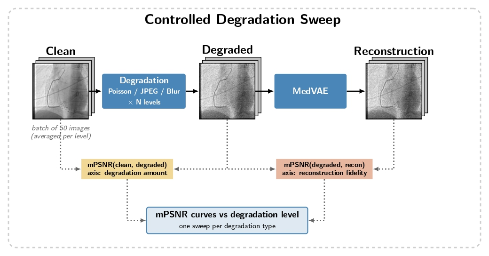
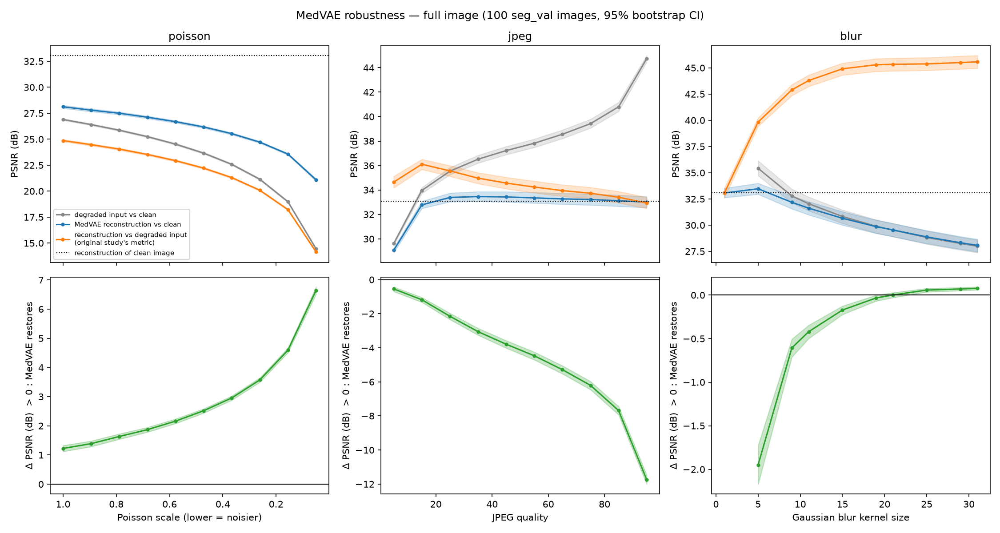
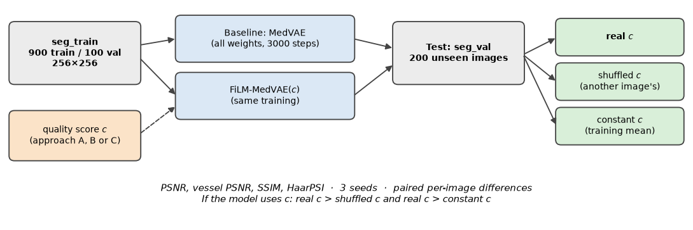
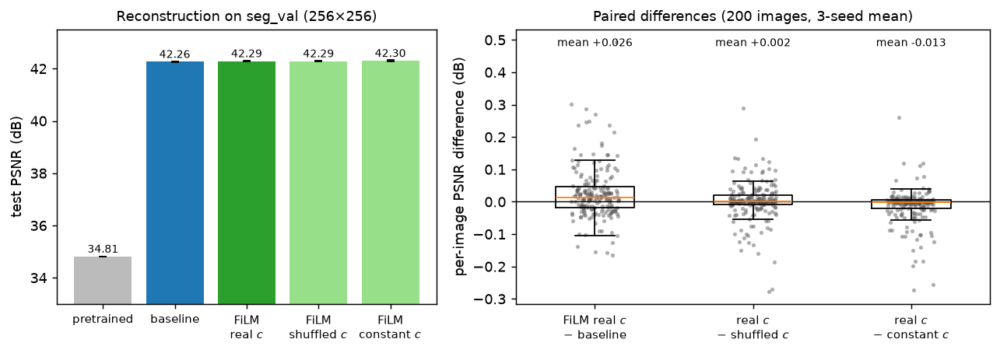
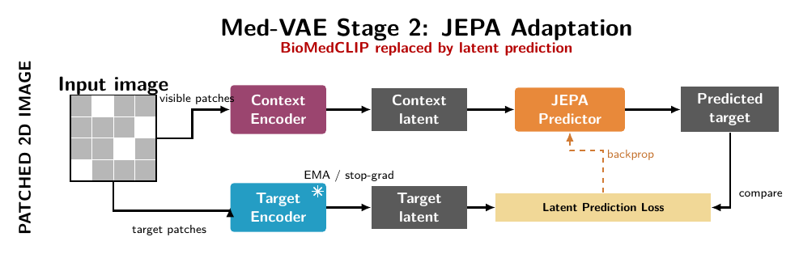
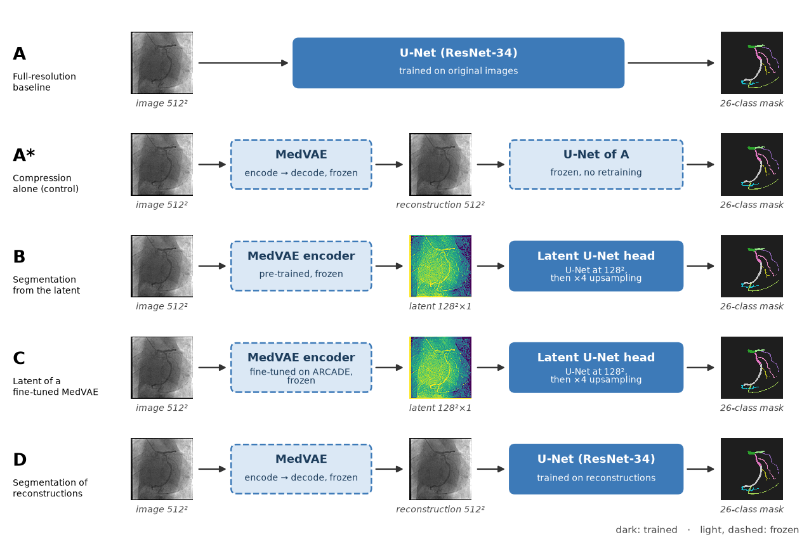
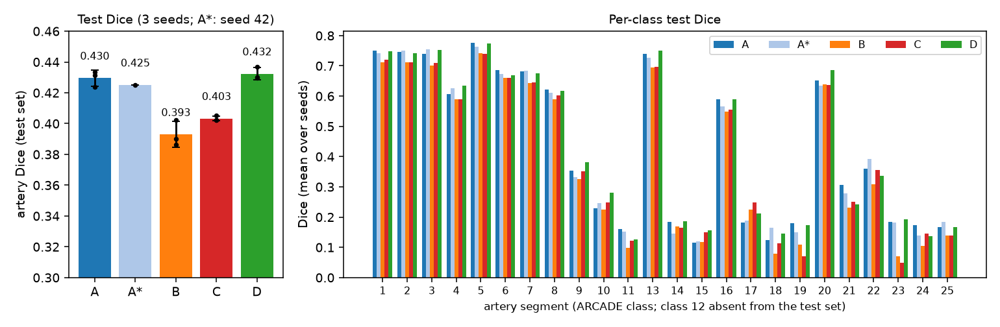
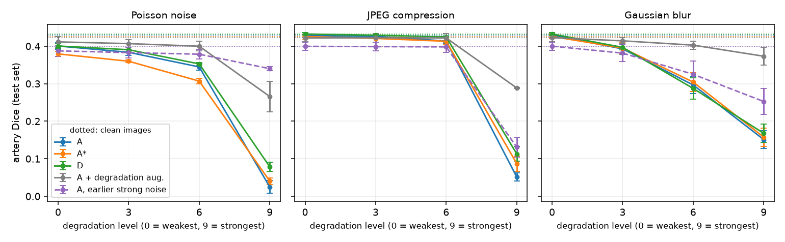

# MedVAE — Adaptation, Fine-tuning and Analysis for Medical Imaging and Coronary Segmentation

[](https://github.com/tnadiedjoa/MEDVAE-X/actions/workflows/tests.yml)

> A four-axis study of **MedVAE**, a generic medical autoencoder, applied to the demanding domain of
> **coronary angiography** (ARCADE dataset). We probe its robustness, its conditioning, its latent
> structure and its usefulness for downstream segmentation.

📄 **[Read the paper](final_report/final.pdf)** &nbsp;·&nbsp; 🖥️ **[See the slides](final_report/presentation.pdf)**

**Authors:** Yanic Rothlingshofer · Théo Palagi · Elias Corlou · Théophile Nadiedjoa
*Télécom Paris — IM06 project*

---

## Overview

MedVAE is a medical image autoencoder pre-trained on chest X-rays and mammographies that compresses
images into a compact latent space. Coronary angiographies are structurally very different from those
modalities: thin tubular vessels, bifurcations and stenosis regions that demand fine-grained spatial
encoding to survive compression.

We investigate **one central question along four complementary axes**: *how far can a generic medical
compressor be trusted, adapted and reused on an out-of-distribution modality?*

| Axis | Question | Lead | Code |
|------|----------|------|------|
| **A. Robustness** | Can MedVAE restore degraded inputs? | Elias Corlou | [`medvae_eval/robustness/`](medvae_eval/robustness/) |
| **B. FiLM conditioning** | Does a quality score help MedVAE reconstruct? | Théophile Nadiedjoa | [`medvae_eval/film/`](medvae_eval/film/) |
| **C. JEPA adaptation** | Can a self-supervised JEPA stage replace BioMedCLIP in stage 2? | Yanic Rothlingshofer | [`jepa_adaptation/`](jepa_adaptation/) |
| **D. Segmentation** | Is the compressed representation enough to segment coronary arteries? | Théo Palagi | [`finetune/`](finetune/) |

### Key takeaway

MedVAE's ×16 compression (in number of values) keeps what coronary segmentation needs: in pixel space (segmenting
reconstructions matches the original images) and in its single-channel latent, which reaches 91–94 %
of the full-image Dice with an adequate head. MedVAE reduces Poisson noise (less than a simple filter), but this does not
make segmentation more robust; conditioning it on a quality score or adapting its encoder with JEPA
brings no gain. Several conclusions of the original study were overturned once measurement and training
issues were fixed: every change and its before/after results are logged in [EXPERIMENTS.md](EXPERIMENTS.md).

---

## A — Robustness of MedVAE to Input Degradations



We ask whether MedVAE can *restore* degraded angiograms (low-dose noise, compression, blur).
For each image and degradation level we compare the reconstruction **to the clean image**:
Δ = PSNR(clean, reconstruction) − PSNR(clean, degraded input), on the whole image and on vessel pixels
(deterministic latent, fixed [0, 1] intensity scale, seeded noise, 100 `seg_val` images × 10 levels,
95 % bootstrap CIs — experiment E11 in [EXPERIMENTS.md](EXPERIMENTS.md)).

| Degradation | Δ PSNR (weakest → strongest) | Images restored |
|---|---|---|
| Poisson noise | **+1.2 → +6.6 dB** | 99–100 % |
| *Poisson noise, simple 5×5 Gaussian filter (reference)* | *+6.3 → +10.3 dB* | *100 %* |
| *Poisson noise, simple 5×5 median filter (reference)* | *+7.2 → +10.0 dB* | *100 %* |
| JPEG (quality 95 → 5) | −11.7 → −0.5 dB | 0–9 % |
| Gaussian blur (kernel 5 → 31) | −2.0 → +0.1 dB (vessels: −2.8 → −0.2) | — |



**Conclusion:** MedVAE **reduces** Poisson noise (the stronger the noise, the larger the gain), but
4 to 5 dB **less than a simple 5×5 filter**: its gain is bounded by its own reconstruction error
(33 dB). It does **not** restore JPEG artefacts (its reconstruction error exceeds them) or blur (the
reconstruction simply follows the blurred input). The original study's "blurred inputs
reconstruct better" measured fidelity to the *degraded* input, which a blurred image trivially helps.

```bash
python medvae_eval/robustness/sweep.py --n-images 100 --levels 10   # → medvae_eval/outputs/robustness/sweep.csv
                                                                    #   (archivé dans experiments/robustness/e11_sweep/)
python medvae_eval/robustness/analyze.py                            # summary table + figures with CIs
python medvae_eval/robustness/baselines.py                          # simple-filter references
```

The original scripts (fidelity to the degraded input, per-image min-max scaling) are kept in
[`medvae_eval/scripts/`](medvae_eval/scripts/) for reference.

---

## B — Image-Quality Inductive Bias (FiLM conditioning)



We ask whether MedVAE (`vae_4x_4c_2D`) reconstructs better when told how degraded its input is: a
scalar quality score `c ∈ [0, 1]` (three constructions: A weighted IQA metrics, B PCA, C learned) is
injected through **FiLM** after each of the 19 ResNet blocks (zero-initialised heads, +1.7M parameters).
Protocol (experiment E13 in [EXPERIMENTS.md](EXPERIMENTS.md)): 256×256, baseline and FiLM trained
identically (all weights, 3000 steps), tested on the 200 unseen `seg_val` images, 3 seeds; each FiLM
model is also evaluated with **another image's score** and with a **constant score**.

| Test PSNR (dB), score C | mean ± std (3 seeds) |
|---|---|
| MedVAE pre-trained | 34.81 |
| Baseline (fine-tuned, no `c`) | 42.26 ± 0.01 |
| FiLM, true `c` | 42.29 ± 0.02 |
| FiLM, shuffled `c` | 42.29 ± 0.02 |
| FiLM, constant `c` | 42.30 ± 0.02 |



**Conclusion:** fine-tuning MedVAE on ARCADE gains **+7.4 dB**; FiLM adds almost nothing on top
(+0.03 dB) and **does not use the quality score**: another image's score or a constant does as well
(scores A and B are used marginally, ≤ 0.04 dB). The score is computed from the image itself, so an
autoencoder of that image gains no information from it. The original study (64×64, KL-dominated loss,
unequal training, single runs) had concluded that conditioning hurts and that score C is exploited.

```bash
python medvae_eval/film/train_film.py --model baseline --seed 42 --run-name e13_film_baseline_seed42
python medvae_eval/film/train_film.py --model film --approach C --seed 42 --run-name e13_film_C_seed42
python medvae_eval/film/analyze.py --group baseline='*_e13_film_baseline_seed4?' \
    --group film_C='*_e13_film_C_seed4?' --ref baseline
python medvae_eval/film/figures.py      # report figures
```

The quality scores are built in notebooks 01–03 of [`medvae_eval/cvae/`](medvae_eval/cvae/)
(IQA metrics, then the three scores); notebooks 04–07 are the original FiLM study, kept for reference.

---

## C — JEPA Adaptation of MedVAE Stage 2



MedVAE's stage 2 relies on **BioMedCLIP** to enrich the latent space. We replace that external
vision-language supervision with a self-supervised **JEPA** objective (inspired by I-JEPA): a context
encoder processes the masked image, an EMA target encoder the full image, and a predictor regresses
the target features of masked patches (Smooth-L1 + SIGReg), with the decoder frozen. Following MedVAE's
recipe on ARCADE, **stage 1** trains an autoencoder of the MedVAE family from scratch (21M parameters,
×8 per side, 64×64×1 latent; test images excluded), and **stage 2** adapts its encoder with JEPA.

Evaluation on the 300 test images, on the layer JEPA trains (features before `conv_out`) — experiment
E14 in [EXPERIMENTS.md](EXPERIMENTS.md):

| | MedVAE (released, ×4) | Stage 1 (×8, from scratch) | Stage 2 JEPA |
|---|---|---|---|
| Reconstruction PSNR (dB) | 34.8 | 30.2 | 17.8 |
| Vessel linear probe (Dice, 3 seeds) | 0.517 ± 0.005 | **0.541 ± 0.005** | 0.485 ± 0.006 |
| Effective rank of the features | 251 / 512 | 111 / 256 | 139 / 256 |

**Conclusion:** learning on coronary angiographies helps (stage 1 separates vessels better than the
released MedVAE), but the JEPA stage **degrades** both the representation (−0.056 on the probe) and,
with a frozen decoder, the reconstruction. It does not compact the latent either: on the trained layer
the effective rank *increases* (as SIGReg intends). The original analysis had measured a layer that is
never trained (`channel_proj`) and included the test images in pre-training.

```bash
sbatch jepa_adaptation/jobs/stage_1.sbatch                 # stage 1 (reconstruction)
sbatch jepa_adaptation/jobs/stage_2.sbatch                 # stage 2 (JEPA), from stage 1's best.pt
python jepa_adaptation/eval/probe.py --model stage2 --ckpt jepa_adaptation/outputs/stage2/best.pt \
    --task vessels --epochs 100 --lr 1e-2                  # linear probe (also: medvae, stage1)
python jepa_adaptation/eval/reconstruction.py --model stage2 --ckpt jepa_adaptation/outputs/stage2/best.pt
python jepa_adaptation/eval/feature_rank.py --model stage2 --ckpt jepa_adaptation/outputs/stage2/best.pt
```

---

## D — MedVAE as a Latent Representation for Coronary Segmentation

We test whether MedVAE's latent can drive **26-class coronary segmentation** on ARCADE (background +
25 artery segments), across comparable conditions:

| Condition | Pipeline | Question |
|-----------|----------|----------|
| **A** | U-Net ResNet-34 on original 512×512 images | High-resolution reference |
| **A\*** | U-Net of A applied, without retraining, to MedVAE reconstructions | What does compression alone cost? |
| **B** | Frozen pre-trained MedVAE encoder + U-Net head at the latent resolution | Is the 128×128×1 latent enough? |
| **C** | Same as B, MedVAE first fine-tuned on ARCADE | Does domain fine-tuning help? |
| **D** | Frozen MedVAE (encode→decode) + U-Net trained on reconstructions | Does adapting to artefacts help? |



Trained on the 1000 `seg_train` images, selected on the official `seg_val` (200), evaluated on the
official test set (300), 3 seeds per condition (experiment E10 in [EXPERIMENTS.md](EXPERIMENTS.md)).
Artery Dice / IoU = mean over the artery segments (background excluded).

| Condition | Artery Dice | Artery IoU | Dice incl. background |
|---|---|---|---|
| A | 0.430 ± 0.005 | 0.308 ± 0.002 | 0.452 |
| A\* (seed 42) | 0.425 | 0.303 | 0.448 |
| B | 0.393 ± 0.008 | 0.277 ± 0.005 | 0.417 |
| C | 0.403 ± 0.002 | 0.285 ± 0.002 | 0.427 |
| D | 0.432 ± 0.004 | 0.311 ± 0.003 | 0.455 |



**Conclusion:** the ×16 compression (in number of values) preserves what segmentation needs. In pixel space,
compression alone costs almost nothing (A\* ≈ A) and training on reconstructions matches the baseline
(D ≈ A). The single-channel **latent is directly usable**: with a U-Net head at the latent resolution,
B and C reach 91–94 % of A's Dice. The original study concluded the opposite (latent Dice 0.04); that
collapse came from a too-low learning rate and a head without spatial context (E03, E04).

**Degraded images (E12, E15).** MedVAE's denoising does not make segmentation more robust: on noisy test
images, A\* (MedVAE then the U-Net of A) is no better than A, and D behaves like A. Robustness comes from
training instead: adding realistic degradations (Poisson noise, JPEG, blur) to A's augmentation raises
the artery Dice under the strongest blur from 0.15 to 0.37 and under the strongest JPEG from 0.05 to 0.29,
for −0.007 on clean images (option `data.degradation_aug_p`, not enabled by default).



```bash
# Always run from the repo root, as a module (imports are absolute)

# (condition C only) fine-tune MedVAE on ARCADE first; prints the command to launch C
python -m finetune.finetune_medvae --config finetune/configs/medvae_finetune.yaml

# train a condition (a | b | c | d); every run gets its folder in experiments/runs/
python -m finetune.train --config finetune/configs/condition_a.yaml --set experiment.seed=43 \
  --run-name e10_seed43_condition_a

# summarise seeds, report figures
python scripts/summarize_runs.py "A=*_e10_seed4?_condition_a" "D=*_e10_seed4?_condition_d" --ref A
python -m finetune.figures_report
```

See [`finetune/README.md`](finetune/README.md) for the full pipeline (A\*, Slurm scripts, hyperparameters).

---

## Repository structure

```
MEDVAE-X/
├── medvae_eval/          # Axes A & B
│   ├── robustness/       #   A: restoration sweep, analysis, segmentation under degradation
│   ├── film/             #   B: FiLM-conditioned MedVAE, training/evaluation, analysis, figures
│   ├── cvae/             #   B: quality-score notebooks (score construction) + original FiLM study
│   └── scripts/          #   A: original robustness scripts (kept for reference)
├── jepa_adaptation/      # Axis C — JEPA self-supervised stage-2 adaptation
│   ├── stage1_training.py / stage2_training.py
│   ├── eval/probe.py     #   linear probe on frozen representations
│   ├── configs/ datasets/ models/ utils/ downstream/ jobs/
├── finetune/             # Axis D — coronary segmentation from MedVAE latents
│   ├── train.py          #   entry point (run as `python -m finetune.train`)
│   ├── evaluate.py       #   re-evaluate a finished run on the test set
│   ├── configs/          #   condition_a … condition_d
│   ├── results/          #   current official results (histories, test scores)
│   ├── encoder/ models/ losses/ metrics/ trainer/ slurm/
├── experiments/
│   ├── runs/             # one folder per run (config, metadata, scores)
│   └── robustness/ film/ diagnostics/  # analyses of the logged experiments
├── EXPERIMENTS.md        # experiment log: every change tested, before/after
├── tests/                # pytest (metrics, configs, runs, models, dataset) — run in CI
├── final_report/         # IEEE paper (final.pdf) + Beamer slides (presentation.pdf)
├── assets/               # figures used in this README
├── scripts/              # download_arcade.sh, promote_run.py, summarize_runs.py
├── data/arcade/          # ARCADE dataset (not versioned, see Setup)
└── README.md
```

---

## Setup

```bash
git clone https://github.com/tnadiedjoa/MEDVAE-X.git && cd MEDVAE-X

# Python 3.10+ recommended
python3 -m venv .venv && source .venv/bin/activate
pip install -r requirements.txt        # or requirements-lock.txt for the exact tested versions

# Strip notebook outputs on commit (run once per clone)
nbstripout --install
```

### Dataset

Experiments use the **[ARCADE](https://zenodo.org/records/10390295)** coronary angiography dataset
(CC0, segmentation phase, 26 arterial classes). It is not versioned; download it with:

```bash
bash scripts/download_arcade.sh
```

The script fetches the Zenodo archive (~450 MB), checks its MD5 and lays it out under `data/arcade/`
following the original challenge structure (`dataset_phase_1/…`, `dataset_final_phase/…`).

All code (YAML configs, scripts, notebooks) resolves dataset paths from the `ARCADE_ROOT`
environment variable, defaulting to `data/arcade/`. If the dataset already lives elsewhere
(e.g. a copy shared on the cluster), point to it instead of downloading:

```bash
export ARCADE_ROOT=/path/to/arcade
```

### Running on the Slurm cluster

Submit jobs **from the repo root**: scripts use `$SLURM_SUBMIT_DIR` as the project directory and
activate `.venv/` from there.

```bash
sbatch finetune/slurm/train_a.sbatch
sbatch jepa_adaptation/jobs/stage_1.sbatch
```

Only the `3090` partition (RTX 3090, 24 GB, max 4 CPUs per GPU) is available to our accounts.

### Experiments

Every training run gets its own folder in `experiments/runs/<date>_<name>/` (exact config,
git commit, GPU, scores). Config values can be overridden without editing the YAML files:

```bash
python -m finetune.train --config finetune/configs/condition_a.yaml \
  --set training.learning_rate=3e-4 --run-name lr3e-4_condition_a
```

Every change tested on the project is logged in [EXPERIMENTS.md](EXPERIMENTS.md) with its
before/after results, whether it was kept or not.

### MedVAE — spatial reminder

`medvae_4_1_2d` compresses **4× per spatial dimension** (not 16×): a 512×512 image → a 128×128×1 latent.
Returning to pixel space therefore needs **2 upsamplings** of ×2 (`n_upsample: 2`).

---

## Acknowledgements

Built on top of [MedVAE](https://github.com/StanfordMIMI/MedVAE) (Stanford MIMI). JEPA adaptation is
inspired by [I-JEPA](https://github.com/facebookresearch/ijepa); the segmentation backbones use
[segmentation_models.pytorch](https://github.com/qubvel/segmentation_models.pytorch).
Third-party code included in this repository is listed in [THIRD_PARTY_NOTICES.md](THIRD_PARTY_NOTICES.md).

## Citation

If you use this code, please cite this repository ([CITATION.cff](CITATION.cff)) and the works it builds on:

```bibtex
@misc{varma2025medvae,
  title  = {MedVAE: Efficient Automated Interpretation of Medical Images with Large-Scale Generalizable Autoencoders},
  author = {Varma, Maya and Kumar, Ashwin and van der Sluijs, Rogier and Ostmeier, Sophie and Blankemeier, Louis
            and Chambon, Pierre and Bluethgen, Christian and Prince, Jip and Langlotz, Curtis and Chaudhari, Akshay},
  year   = {2025},
  eprint = {2502.14753},
  archivePrefix = {arXiv}
}

@article{popov2024arcade,
  title   = {Dataset for Automatic Region-based Coronary Artery Disease Diagnostics Using X-Ray Angiography Images},
  author  = {Popov, Maxim and Amanturdieva, Akmaral and Zhaksylyk, Nuren and others},
  journal = {Scientific Data},
  volume  = {11},
  pages   = {20},
  year    = {2024}
}
```

## License

[MIT](LICENSE) © 2026 Yanic Rothlingshofer, Théo Palagi, Elias Corlou, Théophile Nadiedjoa.
