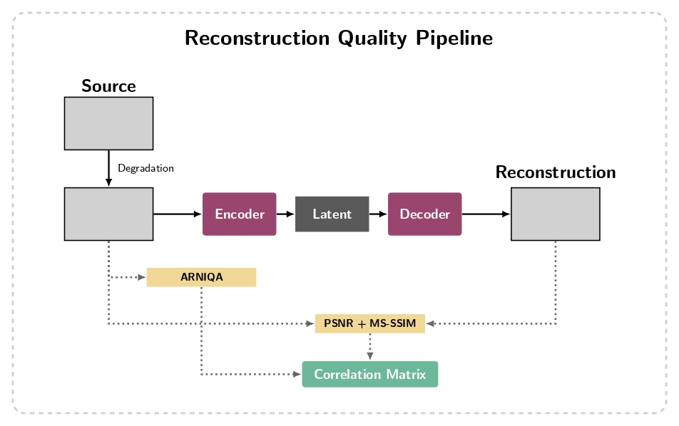
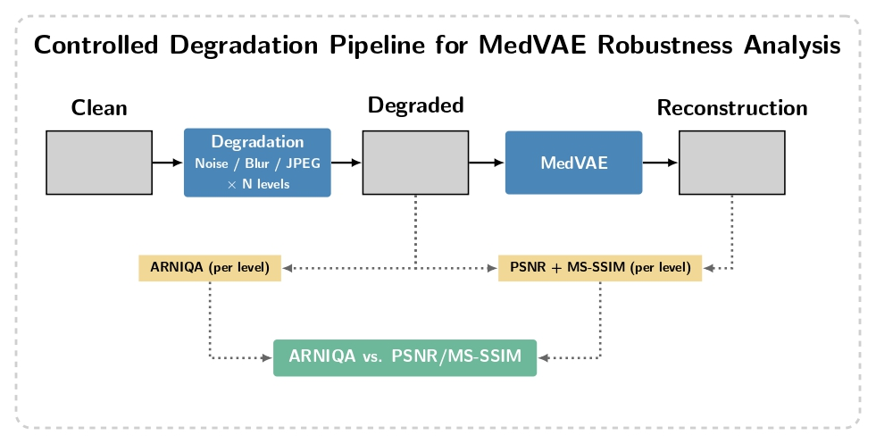

# Récapitulatif - Métriques pour évaluation des performances de MedVAE sur ARCADE (comparaison entrée/sortie)
---

## 1. Choix de la métrique sans référence pour tester la qualité de l'image d'entrée
Nous avons choisi d'utiliser la métrique ARNIQA comme conseillée par l'encadrante du projet.
Le script `run_NR_metrics.py` permet la création d'un `.csv` contenant pour chacune des images du dataset de segmentation (1000 images) un score ARNIQA. Il est à noter que pour l'instant aucune dégradation n'est appliquée au dataset et que cette étape préliminaire permet de voir si il est deja possible d'observer le comportement d'ARNIQA sur le dataset.

En parallèle, Théophile a fait un travail de recherche sur les métriques de qualité adaptées aux images médicales. Plusieurs articles convergent vers le même constat : les métriques sans référence classiques (NIQE, BRISQUE, PIQE, et par extension ARNIQA) ont été conçues et calibrées sur des photos naturelles, et elles ont beaucoup de mal sur les rayons X.

C'est ce qui a mené au score "engineered" de Théophile. Le détail de ce score est expliqué dans `theophile_metrics/recap_theophile.md`.

## 2. Choix de la métrique avec référence pour tester la qualité de reconstruction de MedVAE
PSNR et MS-SSIM étant utilisés dans le papier MedVAE, il est plutôt naturel pour l'instant de se cantonner à ces deux indices. Le script `run_FR_metrics.py` renvoie un `.csv` contenant le PSNR ainsi que le MS-SSIM de chaque image (inférence dans MedVAE).
## 3. Analyse des résultats, comparaisons, corrélations
L'affichage des métriques avec référence par rapport à ARNIQA sur un plan 2D ne permet pas vraiment de mettre en lumière une quelconque corrélation (nuage de points diffus). 

Le script `plot_correlation.py` renvoie aussi une matrice de corrélation qui permet de comprendre que PSNR et MS-SSIM sont corrélés négativement à ARNIQA ce qui signifie :
- plus l'image d'entrée est de bonne qualité au sens de l'indice ARNIQA (ARNIQA élevé = qualité élevée) plus le PSNR/SSIM est mauvais en sortie (un PSNR/SSIM faible indique une mauvaise reconstruction).

Ce résultat est plutôt contre-intuitif, mais on peut peut-être l'expliquer avec le biais de l'indice ARNIQA, celui-ci est entraîné sur des photos naturelles, peut-être que les caractéristiques n'ont pas de sens avec les données dont on dispose. ARNIQA ne permet pas (ce qui est naturel ici puisqu'il s'agit d'images médicales) de determiner quelles sont les images de "haute qualité" au sens de la perception humaine sur des images de ce type.
À noter aussi que la corrélation est calculée sur un nuage très bruité.

## 4. Dégradations synthétiques contrôlées — sweep sur 50 niveaux
Pour lever l'ambiguïté de l'analyse précédente, on applique des dégradations synthétiques contrôlées sur 1000 images propres du dataset avant de les passer dans MedVAE. L'idée est de forcer une variation connue de la qualité d'entrée et d'observer comment PSNR et MS-SSIM évoluent en fonction du score de qualité calculé sur l'image dégradée.

Le script `degradation_eval.py` implémente une rampe linéaire sur 50 niveaux combinant trois types de dégradation simultanément :
- Bruit gaussien additif : σ ∈ [0, 80]
- Flou gaussien : noyau ∈ [1, 31] px
- Compression JPEG : qualité ∈ [95, 5]

Le script permet de choisir la métrique de qualité d'entrée (ARNIQA ou engineered) via un paramètre. Pour chaque niveau, le score choisi, le PSNR et le MS-SSIM sont moyennés sur les images. Les résultats sont sauvegardés dans `outputs/degradation/degradation_results.csv`.

### Analyse des résultats (ARNIQA)

La tendance générale est confirmée : quand la qualité d'entrée baisse (PSNR/MS-SSIM de reconstruction bas), ARNIQA tend à être plus élevé, et inversement. Cela va dans le sens de la corrélation négative observée à l'étape 3, cette fois de façon causale et contrôlée.

Cependant, la courbe ARNIQA en fonction du niveau de dégradation n'est **pas monotone** : elle remonte significativement entre les niveaux 9 et 28. Cela s'explique par le biais de domaine d'ARNIQA — entraîné sur des photos naturelles, il interprète le flou gaussien comme un signe de qualité (image lisse, sans bruit apparent), alors même que l'image médicale est objectivement dégradée. Le score ARNIQA reflète donc davantage l'absence de bruit haute fréquence que la qualité diagnostique réelle de l'image.

Ce comportement confirme qu'ARNIQA n'est pas un indicateur fiable de la qualité d'entrée pour ce type de données, et qu'il ne peut pas être utilisé seul comme axe de comparaison pour cette étude.

## 5. Test du score engineered de Théophile (Option B réalisée)

On a d'abord refait l'analyse de corrélation de l'étape 3 mais avec le score engineered à la place d'ARNIQA, sur les 1000 images de seg_train sans aucune dégradation. Le résultat est une corrélation quasi nulle entre le quality score et le PSNR/MS-SSIM (de l'ordre de -0.007 et 0.010). Autrement dit, sur les images brutes du dataset, le score engineered ne prédit pas mieux la qualité de reconstruction de MedVAE qu'ARNIQA. C'est cohérent avec ce qu'on avait vu : la variance de qualité entre les images propres est trop faible et trop bruitée pour qu'une métrique sans référence en tire quoi que ce soit.

On a ensuite relancé le sweep sur 50 niveaux avec le score engineered.

Le constat est le même qu'avec ARNIQA : le score chute brutalement dès le niveau 2 (apparition du flou avec un noyau de 3 px), passant de 0.41 à 0.13, puis stagne autour de 0.10 sur toute la partie centrale de la rampe. On retrouve donc le même problème : **le flou l'emporte largement sur les autres dégradations** et écrase le score. Le score engineered repose beaucoup sur des métriques de netteté (Tenengrad, Laplacian), or le flou détruit justement cette netteté de façon massive et immédiate, bien avant que le bruit ou la compression n'aient un effet comparable. Du coup, comme avec ARNIQA, on ne capte pas une dégradation progressive et monotone mais surtout l'effet dominant du flou.

À noter quand même une légère remontée du score vers les niveaux 41-44, qui correspond paradoxalement aux niveaux où le bruit devient très fort : le bruit rajoute des hautes fréquences que les métriques de netteté interprètent comme du "signal", ce qui fait remonter artificiellement le score. C'est l'effet inverse du flou, mais le problème est le même — le score ne mesure pas la qualité diagnostique réelle.

## 6. Conclusion et perspectives

Que ce soit avec ARNIQA ou avec le score engineered, on aboutit au même constat : aucune des deux métriques sans référence ne donne un axe de qualité d'entrée propre et monotone une fois qu'on combine les trois dégradations. Le flou gaussien domine tellement les métriques de netteté qu'il masque l'effet du bruit et de la compression. C'est moins un échec des métriques qu'un problème de protocole : combiner les trois dégradations en une seule rampe rend l'interprétation impossible.

Pour la suite, plusieurs pistes :

**Sweeps de dégradations séparés par type**
Plutôt que de combiner les trois dégradations, faire trois sweeps indépendants (bruit seul, flou seul, compression seule). Cela permettrait d'isoler l'effet de chaque dégradation sur PSNR/MS-SSIM et de voir laquelle impacte le plus la reconstruction MedVAE, sans que le flou écrase tout. Attention cependant à ne pas dériver vers une étude des métriques de qualité : l'objectif reste l'évaluation de MedVAE, la métrique de qualité n'est qu'un moyen de quantifier la dégradation d'entrée.

**Autres types de dégradations**
Les dégradations utilisées jusqu'ici sont génériques. On pourrait explorer des dégradations plus spécifiques à l'imagerie coronarographique, notamment :
- Bruit de Poisson (bruit shot) — plus réaliste que le bruit gaussien pour les images rayons X
- Bruit de speckle — caractéristique des capteurs fluoroscopiques
- Flou de mouvement (motion blur) — particulièrement pertinent en coronarographie où le cœur bouge pendant l'acquisition
- Sous/surexposition (ajustement de gamma) — simule des artefacts d'acquisition fréquents
- Réduction de résolution (downsampling + upsampling) — simule une perte de résolution du détecteur

Ces dégradations sont cliniquement motivées et permettraient de tester la robustesse de MedVAE dans des conditions plus proches de la réalité.

**Tester d'autres parties du dataset ARCADE**
Jusqu'ici on travaille uniquement sur le dataset de segmentation (seg_train). ARCADE contient d'autres parties (notamment la partie sténose), avec des images potentiellement différentes en termes de qualité et de contenu. Évaluer MedVAE sur ces autres sous-ensembles permettrait de voir si nos observations se généralisent ou si elles sont spécifiques aux images de segmentation.

## 7. Réorientation : approche full-reference masquée (vessel-only)

Les conclusions des sections 4 à 6 nous ont conduits à abandonner l'axe « qualité d'entrée sans référence » (ARNIQA / engineered). Aucune des deux métriques ne fournit un axe propre et monotone, et surtout la question de recherche est en réalité entièrement full-reference : on dispose à la fois de l'image propre, de l'image dégradée et de la reconstruction. On peut donc tout mesurer par comparaison directe, sans passer par une métrique sans référence.

On redéfinit les deux axes de l'étude ainsi :
- **Axe de dégradation d'entrée** : `PSNR(clean, degraded)` — quantifie de combien l'image dégradée s'éloigne de l'image propre.
- **Axe de qualité de reconstruction** : `PSNR(degraded, recon)` — quantifie la fidélité de la reconstruction MedVAE par rapport à son entrée (l'image dégradée).

La question de recherche devient : **comment la qualité de reconstruction de MedVAE se dégrade-t-elle en fonction de la dégradation réelle de l'entrée ?**

### PSNR masqué (vessel-only)

Un autre résultat contre-intuitif de la section 3 était que le PSNR global *augmentait* avec la dégradation. Sur les images de coronarographie, le fond domine très largement la surface de l'image, donc un PSNR calculé sur toute l'image reflète surtout le fond et pas les vaisseaux — la seule région cliniquement pertinente.

On introduit donc une classe `MaskedPSNR` qui ne calcule le PSNR que sur les pixels de vaisseaux :
- Les annotations d'ARCADE sont des polygones au format COCO dans `seg_train.json` (et non des masques binaires prêts à l'emploi).
- `MaskedPSNR` rasterise ces polygones en masque binaire via `cv2.fillPoly`, redimensionne en 512×512 avec `INTER_NEAREST`, et calcule la MSE uniquement sur les pixels du masque (indexation booléenne des tenseurs).
- Le PSNR est ainsi calculé sur la seule zone d'intérêt, ce qui élimine le biais du fond.

Les deux axes (dégradation et reconstruction) sont calculés en version masquée.

## 8. Sweeps de dégradations séparés par type

Conformément à la piste « sweeps séparés » de la section 6, on abandonne la rampe cumulée (bruit + flou + JPEG simultanés) qui rendait l'interprétation impossible à cause de la domination du flou. On lance maintenant **un sweep par type de dégradation**, isolé, via le script `run_maskedPSNR_sweep.py`.

Le type de dégradation est choisi par une variable `DEGRADATION` en tête de fichier (`"poisson"`, `"jpeg"`, `"blur"`), dont sont dérivés les noms de fichiers de sortie (`masked_sweep_{DEGRADATION}.csv` / `.png`). Chaque sweep applique une rampe linéaire sur `N_LEVELS` niveaux d'un seul type :
- **Bruit de Poisson** : facteur d'échelle ∈ [1.0, 0.05] (plus l'échelle baisse, plus le bruit shot est marqué) — plus réaliste que le bruit gaussien pour les rayons X.
- **Compression JPEG** : qualité ∈ [95, 5].
- **Flou gaussien** : taille de noyau ∈ [1, 31] px (noyaux forcés impairs ; le niveau 0, noyau ≤ 1, correspond à l'image propre).

Pour chaque niveau et chaque image, on calcule `MaskedPSNR(clean, degraded)` et `MaskedPSNR(degraded, recon)`, moyennés sur les images. L'inférence MedVAE est intégrée directement dans la boucle (écriture/lecture d'un `_tmp.png` pour `model.apply_transform()`). Les résultats sont sauvegardés par type dans `outputs/degradation/masked_sweep_{DEGRADATION}.csv`, et un nuage de points reconstruction vs dégradation (coloré par niveau) est généré pour chaque type.

L'objectif est d'isoler l'effet de chaque dégradation sur la reconstruction MedVAE, sans que le flou écrase les autres, et de voir laquelle impacte le plus la qualité de reconstruction.

## 9. Analyse des sweeps masqués séparés par type

Rappel de lecture : la courbe `MaskedPSNR(clean, degraded)` (axe de droite) descend dans tous les cas, c'est attendu (niveau croissant = entrée de plus en plus dégradée). La courbe d'intérêt est `MaskedPSNR(degraded, recon)` (axe de gauche), qui mesure la fidélité de MedVAE à son entrée dégradée.

### Flou gaussien — anti-corrélation nette

Résultat le plus marquant : quand l'entrée se dégrade, la reconstruction *s'améliore* (de ~29 à ~39 dB). MedVAE reconstruit d'autant mieux que l'image est floutée, et les deux courbes sont quasi symétriques.

L'explication tient au caractère passe-bas des autoencodeurs : un VAE compresse vers un latent de faible dimension et reproduit bien les basses fréquences mais mal les hautes (spectral bias, Rahaman et al. 2019 ; flou bien connu des sorties de VAE). Une image floutée est déjà essentiellement basse fréquence : elle vit dans le sous-espace que le VAE reproduit fidèlement, donc elle est « facile » à reconstruire. Ce que le flou retire à l'entrée, il le rend facile à reconstruire — d'où la symétrie. Ce résultat confirme de façon propre et monotone le rôle particulier du flou qui motivait tout le reste de l'étude.

### Bruit de Poisson — corrélation positive, courbes superposées

Comportement miroir du flou, et attendu : le bruit ajoute des hautes fréquences décorrélées, précisément ce que le VAE n'encode pas. L'entrée s'éloigne du propre et la reconstruction se dégrade en parallèle, les deux courbes étant quasi confondues.

Le mécanisme est celui du débruitage par autoencodeur (Vincent et al. 2008) : le goulot latent ne peut pas représenter le bruit haute fréquence, donc il le supprime, et la reconstruction « revient » vers l'image propre. La quasi-superposition des deux courbes n'est donc pas un hasard. Pour le confirmer, tracer `MaskedPSNR(clean, recon)` : si MedVAE débruite réellement, cette courbe devrait rester au-dessus de la courbe dégradée vs clean.

### Compression JPEG — comportement à deux régimes

La reconstruction monte d'abord (~24,5 → ~26 dB jusqu'au niveau 14) puis s'effondre (~26 → ~23,5 dB). Deux régimes se succèdent :
- **Haute/moyenne qualité** : JPEG agit comme un passe-bas par blocs (quantification des coefficients DCT, suppression des hautes fréquences). Il se comporte comme le flou et rend l'entrée plus « VAE-compatible » → la reconstruction monte.
- **Basse qualité** : apparition des artefacts de blocs 8×8 et du ringing autour des bords — structures hautes fréquences spatialement organisées, jamais vues à l'entraînement. MedVAE ne sait ni les encoder ni les ignorer proprement → effondrement de la reconstruction.

Le pic au niveau 14 marque la transition entre ces deux régimes. JPEG n'est donc pas un cas isolé : il combine le régime « flou » (passe-bas, qui aide) puis le régime « bruit structuré » (qui casse la reconstruction).